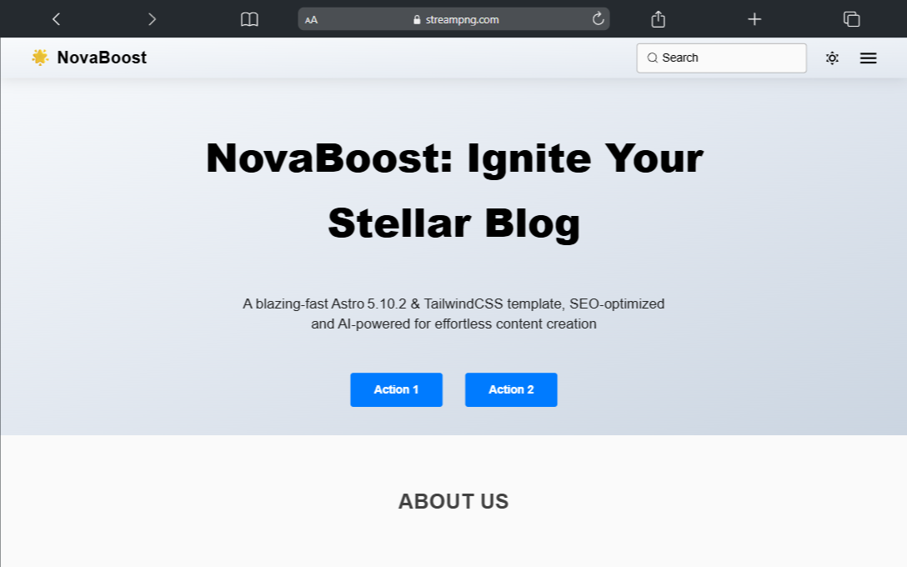

# 🌟 NovaBoost: Free Astro 5 & TailwindCSS Blog Template

A starter blog template built with **Astro 5** and **TailwindCSS**, optimized for performance and SEO, including JSON-LD support and optional AI-powered post generation.

## Table of Contents
* [Features](#features)
* [Getting Started](docs/GETTING_STARTED.md)
* [Usage](docs/USAGE.md)
    * [1. Reset your template](docs/USAGE.md#reset-your-template)
    * [2. Create a collection](docs/USAGE.md#create-a-collection)
    * [3. AI-Powered Post Generation](docs/USAGE.md#ai-powered-post-generation)
    * [4. Available Commands](docs/USAGE.md#available-commands)
    * [5. Customizing Template Content](docs/USAGE.md#customizing-template-content)
* [PageSpeed Insights Results](#pagespeed-insights-results)

   

---

## Features

* **Astro 5**: Leverage the latest Astro version for fast builds and partial hydration.
* **TailwindCSS**: Utility-first styling for rapid UI development.
* **SEO-Optimized**: Meta tags, sitemap, robots.txt, and best practices out of the box.
* **JSON-LD Support**: Structured data for FAQs, articles, breadcrumbs, and more.
* **AI Post Generation**: Optional integration for drafting posts using AI commands.
* **Client-side Search**: Built-in fuzzy search powered by Fuse.js with a prebuilt JSON index.
* **Pagination Support**: Automatically generated paginated routes for large content collections.

---

## PageSpeed Insights Results

You can review the performance and optimization quality of the **NovaBoost** template by checking the PageSpeed Insights results below:

👉 [NovaBoost Template Performance Report](https://pagespeed.web.dev/analysis/https-streampng-com/dssiigc8yv?form_factor=desktop)

This can help you evaluate loading speed, SEO readiness, and best practices compliance before deploying your site.
