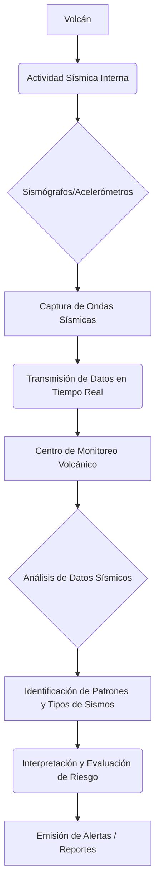

# El Latido Oculto: El Papel Vital de la Sismología en la Vigilancia Volcánica

## Introducción: Escuchando el Corazón de la Tierra

Los volcanes son majestuosas formaciones geológicas, capaces tanto de crear paisajes impresionantes como de desatar una fuerza destructiva. Comprender y predecir su comportamiento es crucial para la seguridad de las comunidades cercanas. Aquí es donde entra en juego la **sismología**, la ciencia que estudia los terremotos y la propagación de ondas sísmicas. En el monitoreo volcánico, la sismología no es solo una herramienta, es el oído que nos permite escuchar el "latido" del volcán y anticipar su despertar.

## ¿Por Qué la Sismología es Crucial en los Volcanes?

La actividad sísmica es uno de los indicadores más tempranos y confiables de que un volcán está experimentando cambios internos. Antes de una erupción, el magma, los gases y los fluidos se mueven bajo tierra, fracturando rocas, creando presiones y generando vibraciones. Estas vibraciones son los sismos volcánicos, y su monitoreo constante permite a los científicos interpretar los procesos subterráneos y evaluar el riesgo de una erupción.

## Tipos de Sismicidad Volcánica: Un Lenguaje Propio

Los volcanes no emiten un solo tipo de señal sísmica. Cada patrón y frecuencia cuenta una historia diferente sobre lo que ocurre en sus profundidades. Conocer estos "lenguajes" es fundamental para la **vigilancia volcánica**:

### Sismos Volcán-Tectónicos (VT)

Son similares a los terremotos tectónicos, causados por la fractura de rocas debido a esfuerzos y tensiones. En un volcán, indican el movimiento de magma o fluidos que ejercen presión sobre las rocas circundantes. Un aumento en su frecuencia y magnitud a menudo precede una erupción.

### Sismos de Largo Período (LP)

Estos sismos tienen frecuencias más bajas y un aspecto más prolongado que los VT. Se asocian con la resonancia de fluidos (magma, gases, agua hidrotermal) moviéndose a través de grietas y conductos dentro de la estructura volcánica. Son un fuerte indicio de actividad magmática o hidrotermal cercana a la superficie.

### Tremor Volcánico

Es una señal sísmica continua y de baja amplitud que puede durar desde minutos hasta días o incluso meses. Puede ser armónico (regular) o no armónico (irregular). El tremor es comúnmente interpretado como el resultado del movimiento sostenido de magma y gases dentro del volcán, o la apertura de nuevas fracturas que permiten su ascenso. Su aparición o intensificación es una señal de alerta crucial.

### Sismos Híbridos

Estos sismos comparten características de los VT y los LP, mostrando componentes de alta y baja frecuencia. Sugieren una combinación de fracturamiento de rocas y movimiento de fluidos, lo que a menudo indica que el magma está interactuando con la roca circundante de manera compleja y vigorosa.

## La Tecnología Detrás de la Detección

Para captar estas sutiles señales, los vulcanólogos instalan redes de **sismógrafos** y acelerómetros alrededor del volcán. Estos instrumentos registran las vibraciones del terreno, transmitiendo los datos en tiempo real a centros de monitoreo. La densidad de la red es clave: cuantos más sensores, mayor precisión en la localización de los sismos y en la comprensión de los patrones.

## Interpretando las Señales: Predicción y Alerta Temprana

El trabajo de los sismólogos no termina con la recolección de datos. La verdadera ciencia radica en la interpretación. Analizan la frecuencia, magnitud, profundidad y tipo de sismos, buscando patrones que indiquen un cambio en el estado del volcán. Un aumento en la sismicidad, el cambio de un tipo de sismo a otro, o la aparición de tremor volcánico, pueden ser indicadores críticos de una erupción inminente, permitiendo a las autoridades emitir alertas y, si es necesario, evacuar a la población a tiempo.

## Conclusión: Vigilancia Constante para la Seguridad

La sismología es la columna vertebral del **monitoreo volcánico** moderno. Al escuchar atentamente el "latido" de la Tierra, los científicos pueden desentrañar los complejos procesos que ocurren bajo la superficie, proporcionando información vital para la mitigación de desastres y la protección de vidas. La vigilancia continua, combinada con otras disciplinas geofísicas, nos permite convivir de manera más segura con estos gigantes dormidos.
